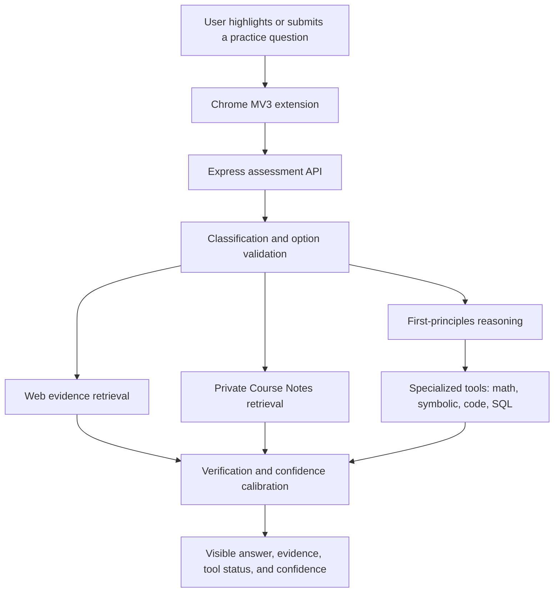

# ExamAssist AI — Evidence-First Study Copilot

[](https://nodejs.org/)
[](https://developer.chrome.com/docs/extensions/mv3/)
[](server/eval/dataset.jsonl)

ExamAssist AI is a Chrome Manifest V3 study copilot with an Express backend. It helps students work through practice questions, problem sets, textbook review, and assessments where AI assistance has been explicitly authorized. Every interaction is visible and user-triggered; the extension never selects or submits answers.

The system is designed to make uncertainty visible. It returns typed errors when AI generation is unavailable, does not invent citations or page numbers, and labels unsupported output as `UNVERIFIED`.

## What it includes

- **Practice and authorized-assessment modes.** Practice Mode is the default. Authorized Assessment Mode requires the user to affirm that AI use is permitted.
- **Evidence-first reasoning.** The pipeline classifies the question, retrieves and ranks available evidence, solves from first principles, verifies claims, and calibrates confidence as `HIGH`, `MEDIUM`, `LOW`, or `UNVERIFIED`.
- **Option integrity checks.** Answer letters and text must match the options that were actually supplied. The system does not fall back to a guessed choice.
- **Question quality warnings.** The backend labels ambiguous, incomplete, contradictory, duplicated, and truncated prompts before solving. A flagged prompt returns `UNVERIFIED`; the panel opens the editable prompt so the learner can add what is missing.
- **Specialized solvers.** Numerical questions use deterministic math evaluation and optional symbolic operations. Coding and debugging problems can run in an isolated Docker service; SQL is evaluated only as a single read query against a fresh in-memory SQLite database. The UI shows tool output only when a tool actually completed.
- **Private Course Notes RAG.** A user can upload PDF, DOCX, Markdown, or text notes. Documents, chunks, and embeddings are scoped to that browser profile and can be deleted from the extension options page.
- **Evaluation and ablations.** A 236-question labeled practice set covers multiple subjects, formats, and difficulty levels. Configurations measure solve-first reasoning, retrieval, tie-breaks, RAG, specialized solvers, and a bounded native tool-calling agent.
- **Bounded native tools.** The optional agent can use web search, private Course Notes, calculation, code execution, and read-only SQL. Every call has strict arguments and bounded call, time, token, and configured-cost limits; failures return to the existing static pipeline.

## Architecture



The backend processes code only through the separate sandbox service. It does not execute submitted code in the Express process. The sandbox uses a read-only container filesystem, resource limits, a private Docker network, a temporary workspace per run, and unprivileged submitted processes. See [Security](docs/SECURITY.md) for the security boundary and limitations.

## Quick start

### Prerequisites

- Docker Desktop with Docker Compose v2
- Google Chrome or another Chromium browser
- Node.js 20+ and npm for local development and tests

### Run the full local stack

```bash
cp .env.example .env
# Edit .env and add OPENAI_API_KEY to enable AI generation.
docker compose up --build -d
curl http://localhost:8787/api/health
```

Compose starts three local services:

| Service | Purpose | Exposure |
|---|---|---|
| `examassist-backend` | Assessment API, RAG orchestration, and extension backend | `127.0.0.1:8787` by default |
| `course-notes-db` | Postgres with pgvector for private notes | Private Docker network only |
| `examassist-sandbox` | Isolated code, SQL, and symbolic solver service | Private Docker network; diagnostic endpoint on `127.0.0.1:8791` |

If port 8787 is already in use, set `EXAMASSIST_HOST_PORT` in `.env` and update the extension's **Backend Server URL** to the same port. For example, `EXAMASSIST_HOST_PORT=8788` pairs with `http://localhost:8788`.

The health response reports whether the AI provider, Course Notes, and sandbox are available:

```json
{
  "status": "ok",
  "aiConfigured": true,
  "ragEnabled": true,
  "sandboxEnabled": true
}
```

No API key is required to start the stack. Requests that need AI generation return the typed `AI_NOT_CONFIGURED` error until `OPENAI_API_KEY` is set; they do not produce a guessed answer.

### Run the backend directly

For a backend-only development setup, install dependencies and provide your own database and sandbox URLs if you want those optional features:

```bash
cd server
npm install
cp .env.example .env
npm start
```

Leave `KB_DATABASE_URL` unset to disable Course Notes when running directly. Set `SANDBOX_URL` only if the backend can reach the isolated sandbox service. `/api/health` exposes the resulting capability flags.

### Load the Chrome extension

1. Open `chrome://extensions/`.
2. Turn on **Developer mode**.
3. Choose **Load unpacked** and select this repository's `extension/` directory.
4. Open the extension popup, choose the allowed site, and use **Settings & Configuration** to set the backend URL if it differs from `http://localhost:8787`.
5. On a practice page, select question text or use the floating action button. Review the question before sending and review the answer before submitting anything yourself.

`sample-assessment.html` provides a local practice page. If Chrome blocks a `file://` URL, serve the repository directory on loopback instead:

```bash
python3 -m http.server 5174 --bind 127.0.0.1
# Open http://127.0.0.1:5174/sample-assessment.html
```

## Course Notes

Open **Extension Options → Course Notes** to upload PDF, DOCX, Markdown, or text files (10 MiB by default). ExamAssist assigns the extension a random local profile ID and retrieves only documents under that profile. Course Notes are evidence, not guaranteed truth: retrieved passages enter the same verification path as other evidence.

The options page lists stored documents and storage use. Deleting a document deletes its associated chunks and embeddings. Review [Privacy](docs/PRIVACY.md) before uploading sensitive material; the local profile ID is a data-scope mechanism for a self-hosted setup, not authentication for a public deployment.

## Specialized solver behavior

| Question family | Tooling | Verification behavior |
|---|---|---|
| Numerical and mathematics | `mathjs`; symbolic operations through SymPy | A disagreement with the generated answer is surfaced and confidence is lowered. |
| Coding and debugging | Python, JavaScript, C, C++, and Java in the isolated sandbox | Test output is recorded only when execution completes. Sandbox failure leaves the result `UNVERIFIED`. |
| SQL | Fresh in-memory SQLite database | Only one `SELECT` or CTE query is allowed; destructive statements are rejected. |
| MCQ and multi-select | Independent candidate answers with evidence comparison | The answer must map to a supplied option and have unique evidence support. |

Tool status is returned in `toolEvidence`. A **Verified by** badge in the extension means that specific tool executed successfully; it does not replace the evidence and confidence labels.

## Evaluation harness

The labeled practice dataset is at [server/eval/dataset.jsonl](server/eval/dataset.jsonl). It contains 236 reviewed items across STEM, humanities, computing, aptitude, and multiple question formats, with at least 20 examples each of coding, SQL, numerical, true/false, and multi-select questions. [server/eval/redteam.jsonl](server/eval/redteam.jsonl) contains 40 adverse cases that must be flagged or left `UNVERIFIED`.

Run an ablation or a deterministic plumbing check from `server/`:

```bash
npm run eval -- --config c_solve_tiebreak --limit 25
npm run eval:smoke
npm run eval:gate
```

Configurations live in `server/eval/configs/`:

| Configuration | Enabled capabilities |
|---|---|
| `a_single_pass` | One reasoning pass |
| `b_solve_evidence` | Solve-first reasoning and retrieval |
| `c_solve_tiebreak` | Solve-first reasoning, retrieval, and disagreement tie-break |
| `d_rag` | Full reasoning plus Course Notes retrieval |
| `e_specialized` | Full pipeline plus deterministic math, code, SQL, and MCQ tools |
| `f_agent` | Native tool-calling loop with web, Course Notes, calculator, code, and SQL tools; static fallback on an agent error |

Each live run writes JSON and Markdown reports to `server/eval/results/`, and caches per-question results under `server/eval/cache/`. Reports include breakdowns by subject, question type, difficulty, and shuffled answer position; confidence calibration; `UNVERIFIED` rate; red-team flag accuracy; retrieval and citation measures where gold data is available; latency percentiles; and token/cost data when the provider reports it or a local rate is configured. `npm run eval:gate` checks the smoke baseline for configured accuracy, calibration, and unsafe-answer regressions. `EVAL_MAX_CALLS` limits provider calls, `EVAL_CONCURRENCY` controls parallelism, and `EVAL_COST_PER_1K_TOKENS_USD` enables an estimated cost field. Smoke mode uses a mock AI and verifies wiring only; it is not representative of live accuracy.

`f_agent` uses `AGENT_MAX_USD` (default `0.05`) and requires `AGENT_COST_PER_1K_TOKENS_USD` so it can enforce a real cost ceiling. If the cost is not configured or an agent/tool budget is exhausted, the request follows the static solve-first pipeline instead.

To evaluate fixture notes with the RAG configuration, set `EVAL_LOCAL_USER_ID` to the browser profile ID that owns the fixture documents. The runner will retrieve only that profile's notes.

## Tests and quality checks

```bash
cd server
npm run lint
npm test
npm run eval:smoke
```

The Node test suite covers question classification, option integrity, typed AI errors, evaluation dataset validation, Course Notes ingestion/retrieval/deletion, pipeline behavior, extension extractors, and specialized solvers. The Docker-backed code and SQL integration cases run when the sandbox is available; they are skipped in a backend-only test environment.

For the full local service check:

```bash
docker compose up --build -d
curl http://localhost:8787/api/health
docker compose ps
```

## API summary

| Method | Endpoint | Description |
|---|---|---|
| `GET` | `/api/health` or `/health` | Runtime health and `aiConfigured`, `ragEnabled`, and `sandboxEnabled` flags |
| `GET` | `/api/config` | Supported question types, modes, and limits |
| `POST` | `/api/assessment/analyze` | Full assessment pipeline; accepts question, options, mode, and optional extracted context |
| `POST` | `/api/assessment/analyze/stream` | SSE progress events (`classified`, `searching`, `retrieved`, `solving`, `verifying`, then `done` or `error`) for a visible, cancellable analysis |
| `POST` | `/api/question/classify` | Classifies a question and its expected evidence needs |
| `POST` | `/api/search` | Generates and executes evidence retrieval queries |
| `POST` | `/api/evidence/verify` | Verifies answer claims against supplied sources |
| `POST` | `/api/answer/generate` | Runs the reasoning engine for a classified question |
| `POST` | `/api/kb/documents` | Uploads and indexes a profile-scoped course note |
| `GET` | `/api/kb/documents` | Lists that profile's documents and storage use |
| `DELETE` | `/api/kb/documents/:id` | Deletes a profile-scoped document, chunks, and embeddings |
| `POST` | `/api/kb/search` | Searches profile-scoped notes for diagnostics |

Course Notes endpoints require the extension's `X-Local-User-Id` header. See [the API reference](docs/API.md) for request and response schemas, errors, and examples.

## Academic integrity, privacy, and security

- Use ExamAssist only for study and assessments where assistance has been expressly permitted.
- The extension never hides itself, evades proctoring, auto-selects an answer, or submits an assessment.
- Credentials stay in backend environment variables. Do not commit `.env` files.
- Sources, page numbers, and tool execution status are never fabricated. If reliable support is unavailable, the response is `UNVERIFIED` or a typed error.
- Course Notes remain private to the configured database and browser profile scope until you delete them. They may be sent to the configured AI provider for embeddings, reranking, or answer generation.

Read [Security](docs/SECURITY.md), [Privacy](docs/PRIVACY.md), [API reference](docs/API.md), and [Architecture](docs/ARCHITECTURE.md) before deploying beyond a trusted local environment.
