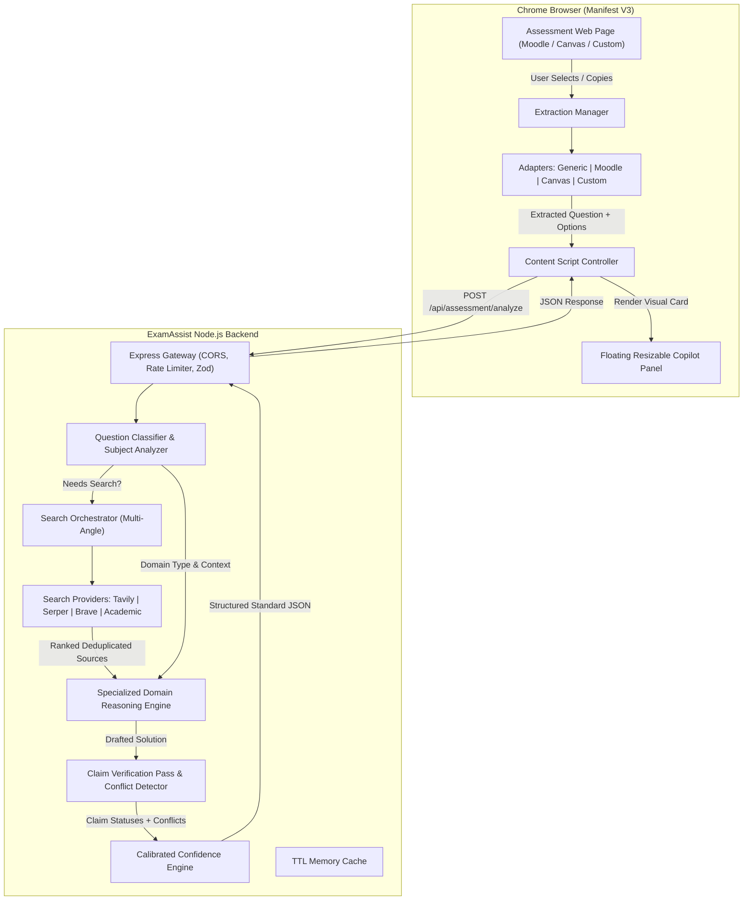
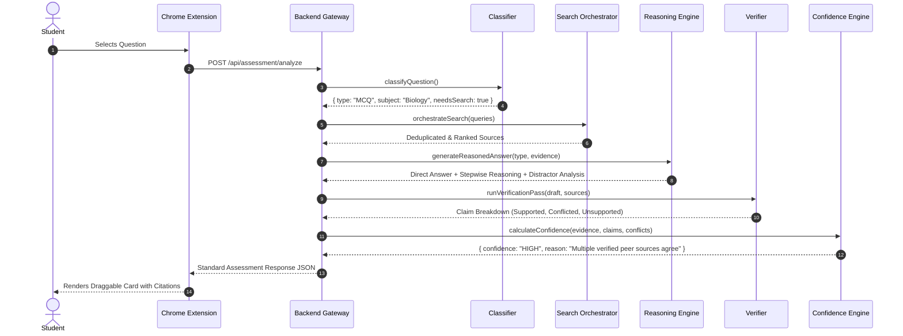
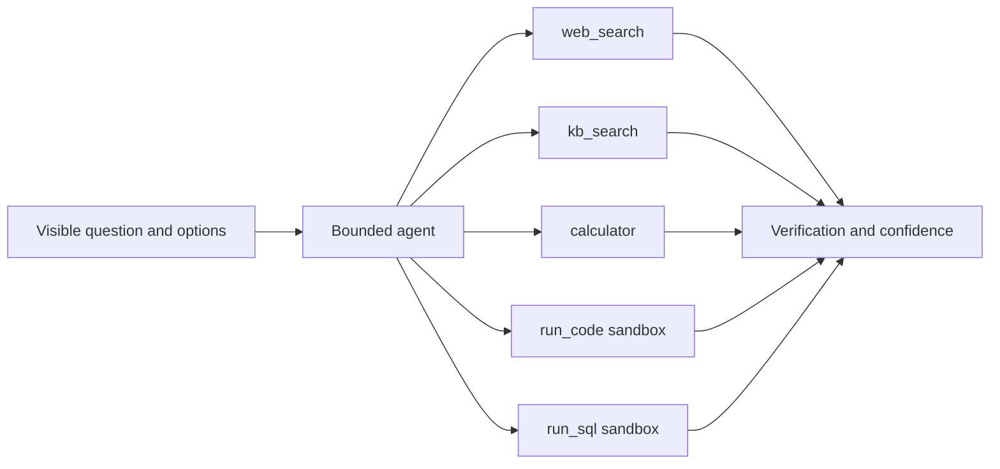

# ExamAssist AI — System Architecture

ExamAssist AI is a production-grade, evidence-first academic study assistant and assessment copilot built on Chrome Manifest V3 and an Express-based reasoning engine.

Unlike simple wrapper extensions that forward raw prompts to an LLM, ExamAssist AI implements an **11-stage evidentiary pipeline** that decomposes academic questions, executes multi-angle search queries across verified sources, evaluates claims independently, eliminates distractors, and calculates calibrated confidence scores.

---

## 1. High-Level System Architecture



---

## 2. Chrome Extension Extraction Architecture (Adapter Pattern)

The browser client uses an extensible **Adapter Pattern** to reliably extract questions, multiple-choice options, code blocks, tables, and mathematical formulas from varied web assessment platforms:

```
extension/extractors/
├── BaseExtractor.js        # Abstract contract with cleanText(), extractCode(), extractMath()
├── GenericExtractor.js     # Universal DOM extractor: user selection, active element, nearest container
├── MoodleAdapter.js        # Specialized for Moodle LMS (.que.multichoice, .formulation, .qtext)
├── CanvasAdapter.js        # Specialized for Instructure Canvas (.question_holder, .question_text)
├── CustomPortalAdapter.js  # Configurable heuristics for custom institutional quiz portals
└── ExtractionManager.js    # Tries platform-specific adapter first, cascades to generic fallback
```

### Extraction Workflow
1. User activates trigger: text selection, clipboard copy, floating button click, or keyboard shortcut (`Ctrl+Shift+E` / `Cmd+Shift+E`).
2. `ExtractionManager.extract()` inspects the document host and DOM structure:
   - If Canvas classes (`.question_holder`) exist, `CanvasAdapter` executes.
   - If Moodle classes (`.que`) exist, `MoodleAdapter` executes.
   - If Custom portal wrappers exist, `CustomPortalAdapter` executes.
   - Otherwise, `GenericExtractor` extracts selected text or inspects nearby container elements.
3. Extracted data is normalized into `{ question, options, containerElement, confidence }`.

---

## 3. Backend Evidentiary Pipeline

The backend executes an 11-step pipeline designed around academic accuracy and transparency:



---

## 4. Question Classification Taxonomy

Questions are classified across 10 distinct analytical types:

| Question Type | Identifying Features | Reasoning Strategy |
| :--- | :--- | :--- |
| `MCQ` | Single-choice radio options | Best option selection + distractor elimination analysis |
| `MULTI_SELECT` | Checkbox options, "select all that apply" | Individual evaluation of each claim's validity |
| `TRUE_FALSE` | Binary truth statements | Evidence verification for factual correctness |
| `FILL_BLANK` | Blank indicators (`___`), missing keywords | Exact term retrieval and context matching |
| `NUMERICAL` | Formulas, variables, numerical values, units | Deterministic step-by-step substitution and unit check |
| `CODING` | Code blocks, functions, algorithms | Execution trace, time/space complexity, syntax check |
| `DEBUGGING` | Code with runtime error, bug identification | Root-cause analysis, line isolation, and patch verification |
| `SQL` | Database queries, tables, schemas | Clause analysis (`SELECT`, `JOIN`, `GROUP BY`, `HAVING`) |
| `CONCEPTUAL` | Definitions, theories, principles | Foundational explanation grounded in academic sources |
| `SHORT_ANSWER` | Open-ended academic prompts | Concise, structured, evidence-supported synthesis |

Before retrieval, the same classifier emits a visible quality disposition: `clear`, `ambiguous`, `missing_info`, `multiple_correct`, `contradictory_options`, or `truncated`. A non-clear disposition skips solving and returns `UNVERIFIED` with a one-line reason and the missing information needed to continue.

---

## 5. Multi-Angle Search & Evidence Ranking

For questions requiring web retrieval, the search orchestrator formulates **3 to 5 distinct queries**:
- **Exact Formulation**: Exact query for specific problem phrasing.
- **Academic / Theoretical**: Query for core underlying principles and formulas.
- **Official Documentation**: Direct queries against official technical documentation.
- **Verification Query**: Confirmatory search testing candidate hypotheses.
- **Counter-Evidence Query**: Targeted search for alternative views or conflicting claims.

Sources are deduplicated and ranked with internal domain and text matching heuristics. The response exposes categorical authority and relevance tiers (`HIGH`, `MEDIUM`, `LOW`, or `UNASSESSED`) rather than fabricated numeric source scores. Recency is included only when the provider supplies it.

---

## 6. Verification Pass & Confidence Engine

Every claim in the answer draft undergoes independent claim verification:
- `SUPPORTED`: Direct factual basis in top retrieved sources.
- `PARTIALLY_SUPPORTED`: Consistent with evidence but with minor extrapolation.
- `INFERRED`: Logically deduced from stated facts.
- `CONTRADICTED`: Conflicting evidence found between independent sources.
- `UNSUPPORTED`: Zero supporting evidence found.

### Confidence Calibration Levels
- **HIGH**: Multiple authoritative sources agree; no unresolvable contradictions; all core claims supported.
- **MEDIUM**: Evidence generally supportive but indirect or from moderate-authority references.
- **LOW**: Evidence is weak, conflicting, or partial; user is alerted to verify manually.
- **UNVERIFIED**: Insufficient or absent reliable sources. Falls back to:
  > *"Unable to verify this answer because reliable evidence was not available."*

---

## 7. Optional Native Tool-Calling Agent

The `f_agent` evaluation configuration can replace the static routing step with an OpenAI-compatible native function-call loop. It receives only the visible question, visible options, and classification. The loop never receives evaluation answer keys, browser state, or hidden page content.



Tool arguments are strict Zod schemas. The loop allows at most six calls and has per-tool, total-time, token, and configured-cost limits. Retrieved content and tool output are treated as untrusted data. A malformed call, exhausted budget, unavailable provider, or failed tool falls back to the static classifier → retrieval → solve-first → verification pipeline. Code and SQL retain the isolated sandbox limits.

---

## 8. Extension UI Architecture

- **Floating Overlay**: Non-intrusive container injected into the host DOM with Shadow DOM or isolated namespace styling.
- **Draggable & Resizable**: Drag handle on header; resize handle on bottom-right corner.
- **Dark / Light Themes**: Instant toggle with persistent user preference in `chrome.storage.local`.
- **Mode Indicator**: Persistent visual badge displaying **Practice Mode** or **Authorized Assessment Mode**.
- **Ephemeral Session History**: Retains question queries during the active session; automatically cleared on close.
- **Safe Clipboard Actions**: "Copy Answer" and "Copy Explanation" copy formatted markdown text to the user's clipboard.
# Course Notes retrieval

Course Notes are an optional layer alongside web evidence. The extension creates a random profile ID in `chrome.storage.local` and sends it as `X-Local-User-Id`; document rows and chunks are scoped to that ID. When Postgres/pgvector is configured and healthy, the backend extracts PDF/DOCX/Markdown/text, chunks text with page/heading metadata, creates batched embeddings, and stores full-text search vectors. Retrieval merges vector and full-text ranks with reciprocal-rank fusion, removes candidates below the configured threshold, and optionally reranks the candidates with the configured AI client. Matching passages enter the existing solve-first/evidence/tie-break flow as `course_notes` sources. No database URL means `ragEnabled:false`, and the core assessment service still starts.

The profile ID is a local separation key for this single-user extension, not an authentication credential for a public multi-user server. Run the backend on a trusted local network or add authenticated user accounts before exposing it to untrusted clients.
