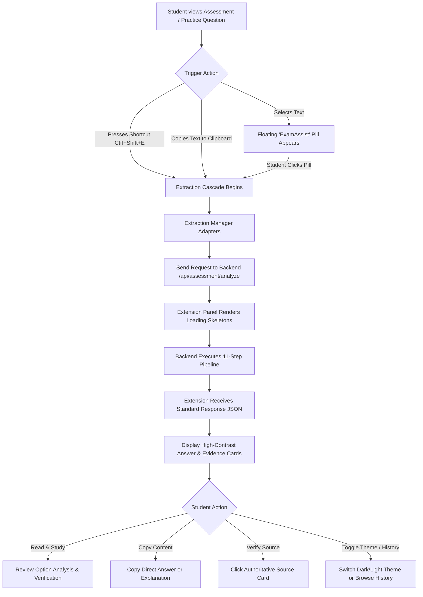
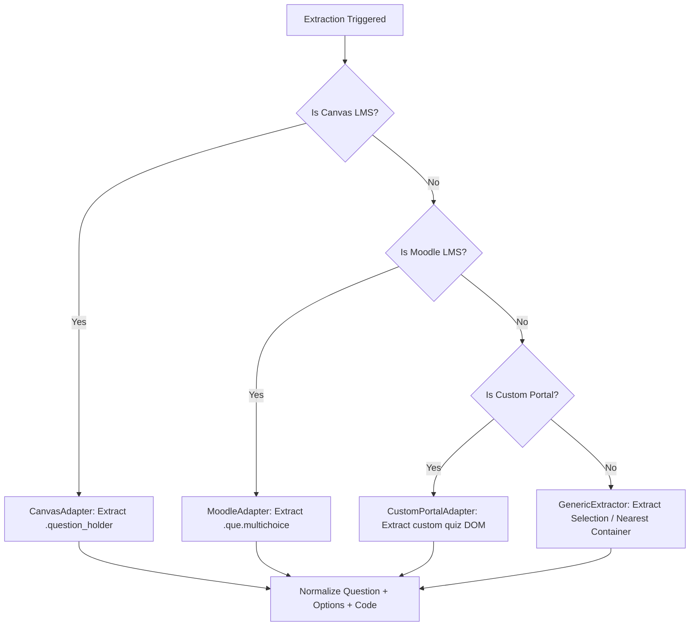

# ExamAssist AI — Student & Copilot Workflow Guide

This document describes the operational workflows of the ExamAssist AI Chrome extension, detailing user triggers, extraction strategies, processing pipelines, user interface actions, and error handling.

---

## 1. End-to-End User Journey

---

## 2. Triggering Mechanisms

Nothing executes automatically without deliberate action from the student. The student initiates assistance through one of four methods:

1. **Text Highlight**: Selecting question or problem text on the page automatically surfaces a compact, floating action pill near the cursor.
2. **Floating Action Button**: Clicking the floating action pill extracts the surrounding question context.
3. **Keyboard Shortcut**: Pressing `Ctrl+Shift+E` (Windows/Linux) or `Cmd+Shift+E` (macOS) triggers immediate extraction of the active element or selection.
4. **Clipboard Copy**: Copying question text to the clipboard prepares the extension context for instant analysis.

---

## 3. Mode Selection & Academic Confirmation

The extension panel header houses the mode selector, which is always visible:

### Practice Mode
- Active by default.
- Intended for self-study, homework problem sets, textbook exercises, and practice tests.

### Authorized Assessment Mode
- Intended for exams and quizzes where the instructor has formally permitted AI study copilot usage.
- **Affirmative Confirmation Modal**: When switching from Practice Mode to Authorized Assessment Mode, the user is presented with a clear consent dialog:
  > *"I certify that my instructor, course syllabus, or exam guidelines explicitly authorize the use of AI assistance and web search for this assessment."*
- If canceled, the extension remains safely in Practice Mode.

---

## 4. Extraction Cascade (Adapter Pattern)

When triggered, the `ExtractionManager` runs an adapter cascade:

The normalized output contains:
- `question`: The clean text prompt, preserving code snippets and math equations.
- `options`: An array of choice strings (if multiple choice).
- `container`: The DOM element reference for optional context highlighting.

---

## 5. Panel Interface & Interactive Actions

Once the backend responds, the floating copilot panel displays the structured result:

### Visual Sections
- **Status & Mode Badge**: Shows whether Practice Mode or Authorized Assessment Mode is active.
- **Question Badge**: Displays detected question type (e.g., `MCQ`, `NUMERICAL`, `CODING`, `SQL`) and academic subject.
- **Direct Answer Callout**: Highlighted answer box with prominent typography.
- **Confidence Badge**: Displays `HIGH`, `MEDIUM`, `LOW`, or `UNVERIFIED` along with a one-line explanation.
- **Explanation & Reasoning Steps**: Stepwise breakdown of how the solution was derived.
- **Distractor Analysis (for MCQs)**: Explicit breakdown of why incorrect options were eliminated.
- **Verification Panel**: Shows factual claims classified as `SUPPORTED`, `CONTRADICTED`, or `UNSUPPORTED`.
- **Citations & Sources**: Interactive cards displaying source title, domain, and authority score. Clicking opens the primary reference in a new tab.

### Action Controls
- **Copy Answer**: Copies the direct answer text directly to the system clipboard.
- **Copy Explanation**: Copies the complete explanation and reasoning steps.
- **Analyze Again**: Re-runs the extraction pipeline on the selected problem.
- **Theme Toggle**: Instantly toggles between light and dark themes.
- **History Viewer**: Allows navigating between queries performed during the active browser session.
- **Close**: Collapses the panel and clears ephemeral session memory.

---

## 6. Edge Cases & Graceful Degradation

| Scenario | System Behavior |
| :--- | :--- |
| **No Selection Detected** | Prompts user: *"Please highlight or click on a question to analyze."* |
| **Search Providers Offline** | Automatically falls back to offline academic knowledge bases and internal model reasoning. |
| **Contradictory Sources Found** | Sets confidence to `LOW` or `CONFLICTING`, highlights the specific disagreement in the verification panel. |
| **Zero Authoritative Evidence** | Assigns `UNVERIFIED` confidence and outputs: *"Unable to verify this answer because reliable evidence was not available."* |
| **Network Failure / Backend Down** | Displays clear connection diagnostic banner with instructions to start the backend on port 8787. |
| **Rate Limit Exceeded** | Shows a polite cooldown timer with the exact retry duration in seconds. |
